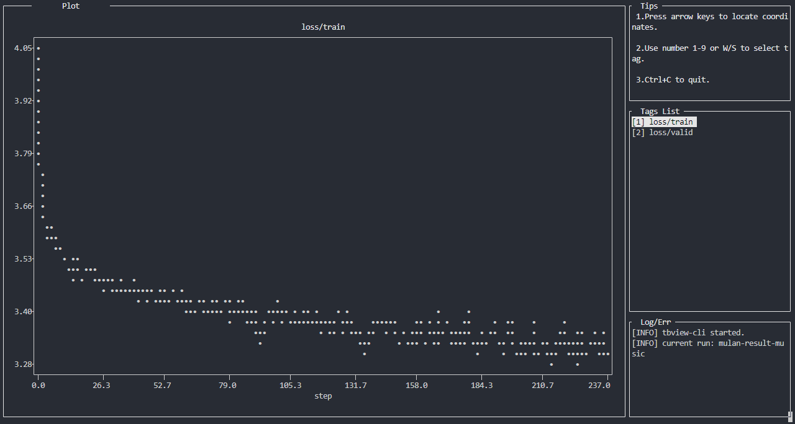

# tbview-cli: Command-Line Tensorboard Viewer

A command line interface tool for Tensorboard visualization. No tensorflow dependency, no web server.



## Get Started

Firstly, please git clone this project and install it:

```shell
$ cd path/to/tbview-cli
$ pip install -e .
```

## Usage

After setup, you can use `tbview` command to view a tensorboard event file. For example:

```shell
tbview path/to/events/file
```

or view a result directory:

```shell
tbview path/to/events/dir
```

## Acknowledgement

This project is still in progress,  and some features may not be complete.
